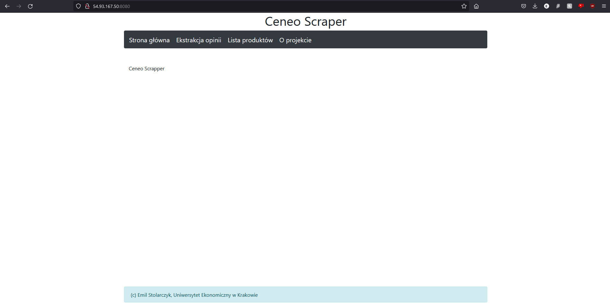

# Ceneo-Scraper-Sokrates

1. Sklonować to repozytorium
2. Zmodyfikować odpowiedno adresy ip w pliku hosts.ini
3. Wpisać w konsoli "eval `ssh-agent`"
4. Wpisać w konsoli "ssh-add <ścieżka do klucza id_student>"
5. Wejść do folderu głównego repozytorium
6. Wpisać w konsoli "ansible-playbook -i hosts.ini setup.yml"

